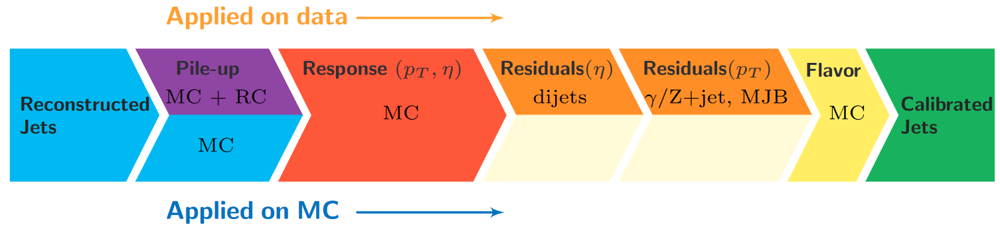

Unsurprisingly, the CMS detector does not measure jet energies perfectly, nor
do simulation and data agree perfectly! The measured energy of jet must be
corrected so that it can be related to the true energy of its parent particle.
These corrections account for several effects and are factorized so that each
effect can be studied independently. 

## Correction levels

Particles from additional interactions in nearby bunch crossings of the LHC contribute energy in the calorimeters that must somehow be distinguished from the
energy deposits of the main interaction. Extra energy in a jet's cone can make its measured momentum larger than the momentum of the parent particle.
The first layer ("L1") of jet energy corrections accounts for pileup by subtracting the average transverse momentum contribution of the pileup interactions to
the jet's cone area. This average pileup contribution varies by pseudorapidity and, of course, by the number of interactions in the event. 

The second and third layers of corrections ("L2L3") correct the measured momentum to the true momentum as functions of momentum and pseudorapidity, bringing
the reconstructed jet in line with the generated jet. These corrections are derived using momentum balancing and missing energy techniques in dijet and Z
boson events. One well-measured object (ex: a jet near the center of the detector, a Z boson reconstructed from leptons) is balanced against a jet for which
corrections are derived.

All of these corrections are applied to both data and simulation. Data events are then given "residual" corrections to bring data into line with the corrected
simulation. A final set of flavor-based corrections are used in certain analyses that are especially sensitive to flavor effects. All of the corrections are
described in [this paper](https://arxiv.org/pdf/1107.4277.pdf). The figure below shows the result of the L1+L2+L3 corrections on the jet response.

There are several methods available for applying jet energy corrections to reconstructed jets. We have demonstrated a method to read in the corrections from
text files and extract the corrections manually for each jet. In `simulation_cfg.py` the file names are passed to the `AOD2NanoAOD` analyzer:

~~~
process.aod2nanoaod = cms.EDAnalyzer("AOD2NanoAOD",
        jecL1Name = cms.FileInPath('workspace/AOD2NanoAOD/Summer12_V7_MC/Summer12_V7_MC_L1FastJet_AK5PFchs.txt'),
        jecL2Name = cms.FileInPath('workspace/AOD2NanoAOD/Summer12_V7_MC/Summer12_V7_MC_L2Relative_AK5PFchs.txt'),
        jecL3Name = cms.FileInPath('workspace/AOD2NanoAOD/Summer12_V7_MC/Summer12_V7_MC_L3Absolute_AK5PFchs.txt'),
        jecUncName = cms.FileInPath('workspace/AOD2NanoAOD/Summer12_V7_MC/Summer12_V7_MC_Uncertainty_AK5PFchs.txt'),
        isData = cms.bool(False)
~~~
{: .source}

In `AOD2NanoAOD.cc` the files are read to build a `factorizedJetCorrector` object from which the corrections can be accessed:

~~~
// Object definitions
bool isData;
std::vector<std::string> jecPayloadNames_;
std::string              jecL1_;
std::string              jecL2_;
std::string              jecL3_;
boost::shared_ptr<FactorizedJetCorrector> jec_;

// In the constructor the factorizedJetCorrected is set up
AOD2NanoAOD::AOD2NanoAOD(const edm::ParameterSet &iConfig){
  isData = iConfig.getParameter<bool>("isData");
  jecL1_ = iConfig.getParameter<edm::FileInPath>("jecL1Name").fullPath(); // JEC level payloads                     
  jecL2_ = iConfig.getParameter<edm::FileInPath>("jecL2Name").fullPath(); // JEC level payloads                     
  jecL3_ = iConfig.getParameter<edm::FileInPath>("jecL3Name").fullPath(); // JEC level payloads                     

  //Get the factorized jet corrector parameters.
  jecPayloadNames_.push_back(jecL1_);
  jecPayloadNames_.push_back(jecL2_);
  jecPayloadNames_.push_back(jecL3_);
    
  std::vector<JetCorrectorParameters> vPar;
  for ( std::vector<std::string>::const_iterator payloadBegin = jecPayloadNames_.begin(),
    payloadEnd = jecPayloadNames_.end(), ipayload = payloadBegin; ipayload != payloadEnd; ++ipayload ) {
    JetCorrectorParameters pars(*ipayload);
    vPar.push_back(pars);
    }

  // Make the FactorizedJetCorrector and Uncertainty                                                                                              
  jec_ = boost::shared_ptr<FactorizedJetCorrector> ( new FactorizedJetCorrector(vPar) );

  // ....function continues
}
~~~
{: .source}

In the `analyze` function the correction is evaluated for each jet. The correction depends on
the momentum, pseudorapidity, energy, and cone area of the jet, as well as the value of "rho" (the average momentum
per area) and number of interactions in the event. The correction is used to scale the momentum of the jet.

~~~
Handle<double> rhoHandle;
iEvent.getByLabel(InputTag("fixedGridRhoFastjetAll"), rhoHandle);

for (auto it = jets->begin(); it != jets->end(); it++) {
  if (it->pt() > jet_min_pt) {

    reco::Candidate::LorentzVector uncorrJet = it->p4();
    jec_->setJetEta( uncorrJet.eta() );
    jec_->setJetPt ( uncorrJet.pt() );
    jec_->setJetE  ( uncorrJet.energy() );
    jec_->setJetA  ( it->jetArea() );
    jec_->setRho   ( *(rhoHandle.product()) );
    jec_->setNPV   ( vertices->size() );

    double corr = jec_->getCorrection();

    value_jet_pt[value_jet_n] = it->pt();
    value_corr_jet_pt[value_jet_n] = corr * uncorrJet.pt();
   
  }
}
~~~
{: .source}

>## Challenge: add L2L3 residual corrections to data
>
>In data, the L2L3 residual corrections should also be applied. Use the "isData" switch and set up `AOD2NanoAOD.cc` and `data_cfg.py`
>to fully correct jets in data.
{: .challenge}

These corrections account for differences between the true and measured energy *scale* of jets, but not the energy *resolution*. The jet momentum resolution
is typically too small in simulation and is widened using a Gaussian smearing technique. Watch for implementation details on this correction in a future
update to the Open Data Guide. 

## Uncertainties

You will have noticed that nested among the jet energy correction code snippets give above were commands related to the uncertainty in this correction.
The uncertainty is also read from a text file in this example, and is used to increase or decrease the correction to the jet momentum. 

~~~
// Object definition
boost::shared_ptr<FactorizedJetCorrector> jec_;

// In the constructor the JetCorrectionUncertainty is set up
AOD2NanoAOD::AOD2NanoAOD(const edm::ParameterSet &iConfig){

  jecUncName_ = iConfig.getParameter<edm::FileInPath>("jecUncName").fullPath();      // JEC uncertainties                               
  jecUnc_ = boost::shared_ptr<JetCorrectionUncertainty>( new JetCorrectionUncertainty(jecUncName_) );

  // ....function continues
}

// In the analyze function the uncertainty is evaluated
for (auto it = jets->begin(); it != jets->end(); it++) {
  if (it->pt() > jet_min_pt) {

    double corr = jec_->getCorrection();

    jecUnc_->setJetEta( uncorrJet.eta() );
    jecUnc_->setJetPt( corr * uncorrJet.pt() );
    double corrUp = corr * (1 + fabs(jecUnc_->getUncertainty(1)));
    double corrDown = corr * ( 1 - fabs(jecUnc_->getUncertainty(-1)) );

    value_corr_jet_ptUp[value_jet_n] = corrUp * uncorrJet.pt();
    value_corr_jet_ptDown[value_jet_n] = corrDown * uncorrJet.pt();
   
  }
}
~~~
{: .source}

The uncertainties have several sources, shown in the figure below. The L1 (pileup) uncertainty dominates at low momentum,
while the L3 (absolute scale) uncertainty takes over for higher momentum jets. All corrections are quite precise for
jets located near the center of the CMS barrel region, and the precision drops as pseudorapidity increases and different
subdetectors lose coverage. 

>## Challenge: shifted histograms
>
>Plot and investigate the range of momentum variation given by the JEC uncertainties. Is the difference between the
>raw and corrected momentum larger or smaller than the uncertainty? Use TTree::Draw to make histograms of the various
>momentum distributions. Ideally, show the up and down variations in different colors, and the raw vs corrected momenta
>with different line styles.
{: .challenge}



